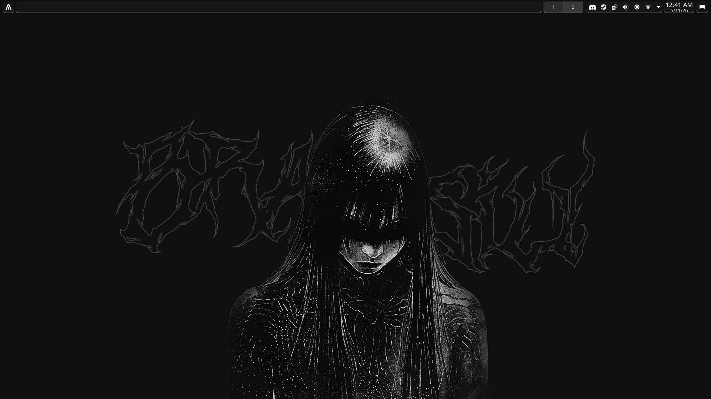

# dotfiles

Arch Linux provisioning + user environment.



## Quick start

```bash
git clone https://github.com/Zolkyed/dotfiles ~/dotfiles
cd ~/dotfiles
just ansibleinstall desktop
```

## Commands

```bash
just setup-dev       # create .venv with linters
just run <host>      # run playbook via SSH
just run-local <host> # run playbook locally
just check <host>    # dry-run
just lint            # yamllint + shellcheck + ansible-lint
just syntax          # Ansible syntax checks
just integration     # build the Arch Linux Docker smoke-test image
just vault-edit      # edit SOPS vault
just vault-view      # view SOPS vault
just apply           # chezmoi apply
just diff            # chezmoi diff
```

## Structure

```
.
├── ansible/                    # provisioning
│   ├── playbooks/              # setup, update, maintenance, dotfiles
│   ├── inventory/
│   │   ├── hosts.yml           # SSH inventory
│   │   ├── local.yml           # local inventory
│   │   └── {group,host}_vars/  # config + secrets
│   └── roles/{apps,desktop,lib,system,user}/
├── archinstall/                 # ISO installer config
├── assets/                     # icons, wallpapers
├── chezmoi/                    # user dotfiles
│   ├── dot_zshrc
│   └── dot_config/{helix,kitty,tmux,yazi,zsh}/
├── docker/                     # CI test image
├── scripts/                    # bootstrap helpers
├── secrets/                    # encrypted age key
└── Justfile
```

## Design

- **Ansible** → packages, services, users, boot config
- **Chezmoi** → shell, editor, terminal, theme
- **SOPS + age** → secrets encrypted at rest
- **`group_vars/all.yml`** → user defaults and host feature presets
- **role defaults** → package, service, and app lists for each role
- **`host_vars/<host>/vars.yml`** → active preset selection
- **auto-detect** → GPU features (`nvidia_gpu`, `amd_gpu`, `intel_gpu`) are detected from `lspci` at runtime

## Host presets

| Host | Features |
|---|---|
| desktop | audio, avahi, bluetooth, vpn, firewall, fail2ban, firmware, bootloader, snapper, docker, virtualization, plasma, browser, dev, flatpak, mihon, media, office, ai, rclone, gaming, xdg, plymouth, tools |
| laptop | audio, avahi, bluetooth, vpn, firewall, fail2ban, firmware, bootloader, snapper, docker, virtualization, plasma, browser, dev, flatpak, mihon, media, office, ai, rclone, xdg, plymouth, tools |
| server | vpn, firewall, fail2ban, bootloader, snapper, docker, virtualization |

## References

- [shricodev/dotfiles](https://github.com/shricodev/dotfiles)
- [KDE monochrome in the night](https://www.reddit.com/r/unixporn/comments/1qimvm8/kde_monochrome_in_the_night/)
